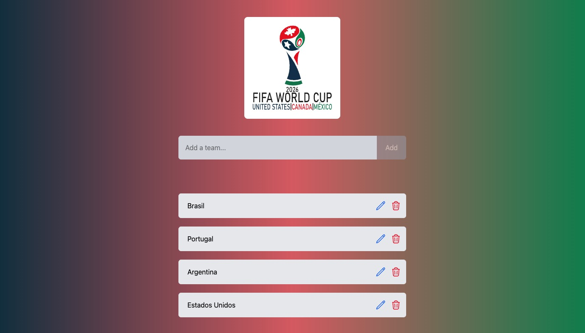

React World Cup themed todo team list.
[See the project](https://caueamaral.github.io/react-wc2026-todo).



## React

- Tailwind CSS
- useEffect()
- useState()
- Vite

### How to use it

Use Node `v24.15.0` for better compatibility.

1 - Clone the repository.

```sh
git clone https://github.com/caueamaral/react-wc2026-todo.git
```

2 - Install the dependencies.

```sh
npm install
```

3 - Start the web server.

```sh
npm run dev
```

4 - Open localhost in the browser.

```sh
http://localhost:5173
```
